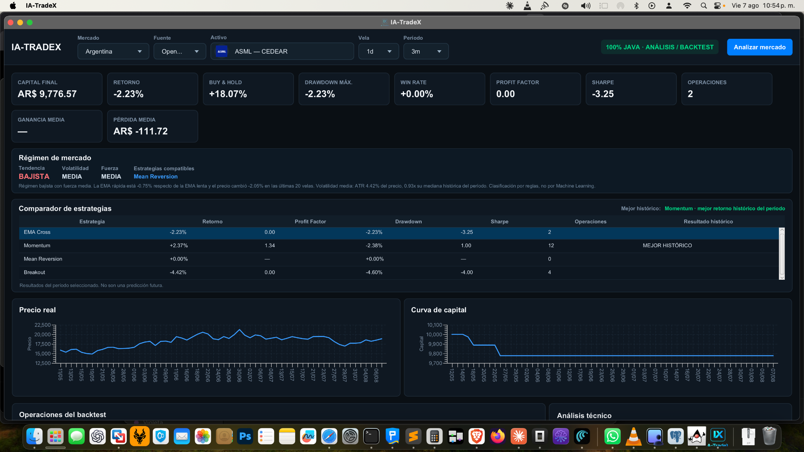
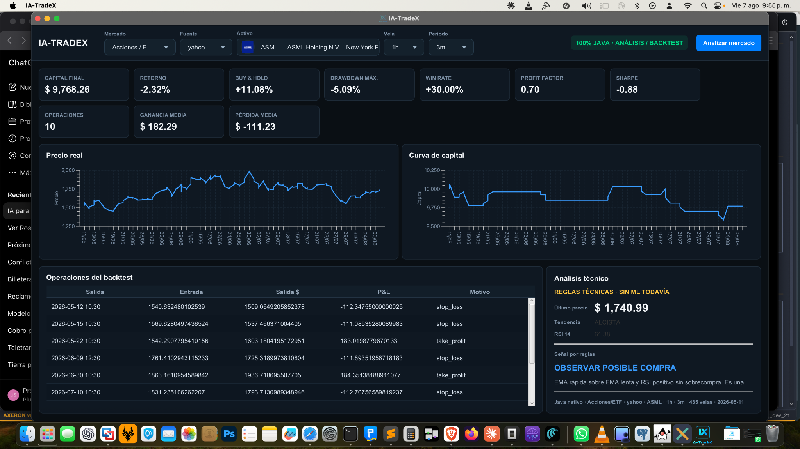
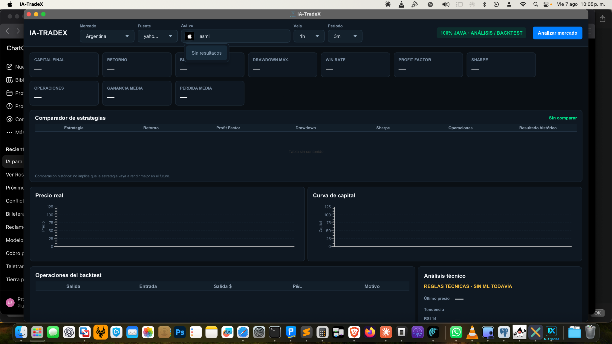
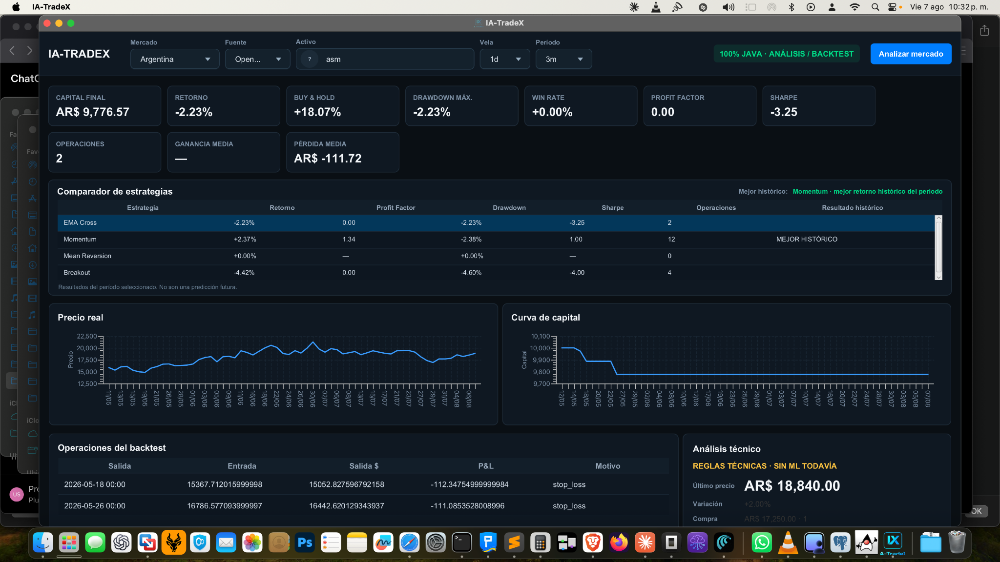

# IA-TradeX


**IA-TradeX** es una plataforma open source de análisis de mercados, backtesting y experimentación cuantitativa desarrollada **100% en Java**.

No requiere Python, FastAPI, `uvicorn` ni entornos virtuales. La aplicación JavaFX obtiene datos de mercado directamente y ejecuta indicadores, estrategias, backtesting, métricas y clasificación de régimen dentro del mismo proceso Java.

> Proyecto educativo, de investigación y desarrollo de software.  
> No constituye asesoramiento financiero ni garantiza resultados futuros.

## Capturas

### Dashboard principal


### Comparador de estrategias


### Mercado Argentina / Internacional


### Buscador de CEDEARs y acciones



## Funcionalidades actuales

### Mercados

**Criptomonedas**
- Binance
- Kraken
- BTC/USDT
- ETH/USDT
- Datos OHLCV públicos por REST

**Argentina**
- CEDEARs
- Acciones argentinas
- Open BYMADATA
- Cotizaciones locales en ARS
- Bid / Ask y cantidades cuando están disponibles
- Histórico diario
- Datos públicos con aproximadamente 20 minutos de demora

**Internacional**
- Acciones y ETF
- Yahoo Finance
- Búsqueda por ticker o nombre
- Autocomplete con logo, ticker, empresa y mercado
- Cotización internacional separada del equivalente argentino

## Estrategias

IA-TradeX compara actualmente cuatro estrategias:

- **EMA Cross**
- **Momentum**
- **Mean Reversion**
- **Breakout**

Todas se prueban sobre el mismo histórico y con los mismos costos simulados.

El comparador muestra:

- retorno;
- Profit Factor;
- Drawdown;
- Sharpe;
- cantidad de operaciones;
- mejor resultado histórico del período.

**MEJOR HISTÓRICO** no significa que esa estrategia vaya a rendir mejor en el futuro.

## Indicadores

- EMA 12
- EMA 26
- RSI 14
- ATR 14
- cruces EMA
- tendencia actual
- señales técnicas explicables

## Régimen de mercado

IA-TradeX clasifica el contexto actual como:

- ALCISTA
- BAJISTA
- LATERAL

También clasifica:

- fuerza: BAJA / MEDIA / ALTA;
- volatilidad: BAJA / MEDIA / ALTA;
- estrategias compatibles con el contexto.

La volatilidad se compara contra el comportamiento histórico del mismo activo usando ATR porcentual.

## Backtesting

- señal calculada sobre la vela anterior;
- ejecución en la apertura de la vela siguiente;
- comisión;
- slippage;
- riesgo por operación;
- stop-loss;
- take-profit;
- salida por señal;
- hipótesis conservadora si stop y objetivo ocurren dentro de una misma vela.

## Métricas

- capital final;
- retorno;
- Buy & Hold;
- Drawdown máximo;
- Win Rate;
- Profit Factor;
- Sharpe Ratio;
- cantidad de operaciones;
- ganancia media;
- pérdida media.

## Interfaz

- JavaFX 23;
- dashboard oscuro;
- gráficos de precio y equity;
- tabla de operaciones;
- comparador de estrategias;
- panel de régimen;
- buscador/autocomplete de activos;
- scroll vertical;
- layout responsive;
- aplicación macOS de doble clic.

## Arquitectura

```text
┌────────────────────────────────────────┐
│             JavaFX Desktop             │
│                                        │
│ UI · búsqueda · gráficos · portfolio   │
└────────────────────┬───────────────────┘
                     │ Java
                     ▼
┌────────────────────────────────────────┐
│           Motor IA-TradeX              │
│                                        │
│ MarketService                          │
│ IndicatorEngine                        │
│ MarketRegimeEngine                     │
│ StrategySignalEngine                   │
│ BacktestEngine                         │
│ AnalysisService                        │
└────────────────────┬───────────────────┘
                     │ HTTP REST
          ┌──────────┼──────────────┐
          ▼          ▼              ▼
      Binance      Kraken      Yahoo / BYMADATA
```

## Requisitos de desarrollo

- Java 21+
- Maven

## Ejecutar durante el desarrollo

```bash
mvn clean javafx:run
```

## Crear la aplicación macOS

```bash
./package-macos.sh
```

Resultado:

```text
dist/IA-TradeX.app
```

Para generar un instalador DMG:

```bash
./package-macos-dmg.sh
```

La aplicación empaquetada incluye su runtime Java, por lo que el usuario final no necesita Maven ni Python.

## Documentación

- [Manual de usuario](docs/MANUAL.md)
- [Changelog](docs/CHANGELOG.md)

El manual se mantiene durante el desarrollo para que la documentación final no tenga que reconstruirse desde cero.

## Próximas etapas

- Paper Trading
- cartera simulada persistente
- posiciones abiertas/cerradas
- P&L realizado y no realizado
- WebSockets / datos en vivo
- validación walk-forward
- validación fuera de muestra
- Machine Learning
- noticias y sentimiento
- explicabilidad de modelos

## Acerca de

**Juan Manuel De Castro**  
**Email:** jm@pronexo.com  
**Web:** https://www.pronexo.com

## Licencia

IA-TradeX se distribuye bajo la **GNU Affero General Public License v3.0 (AGPL-3.0)**.

La AGPLv3 exige que las modificaciones de la aplicación también permanezcan disponibles bajo los términos de la licencia cuando el software se distribuye o se ofrece a usuarios a través de una red.

Consulta el archivo [LICENSE](LICENSE) para el texto completo.
